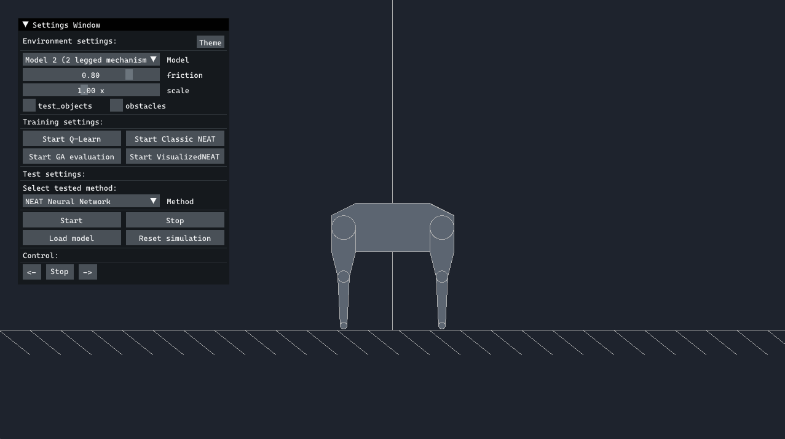
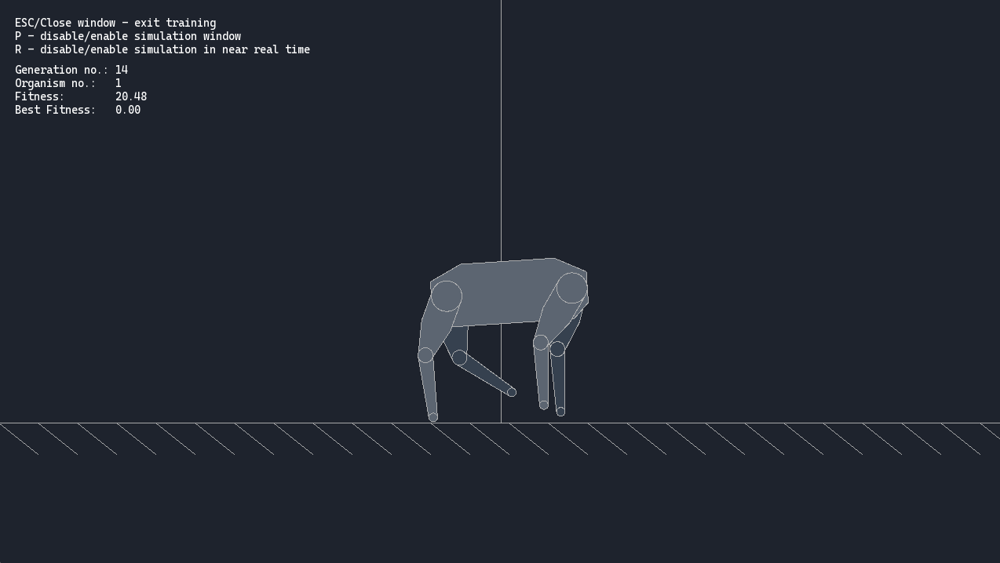
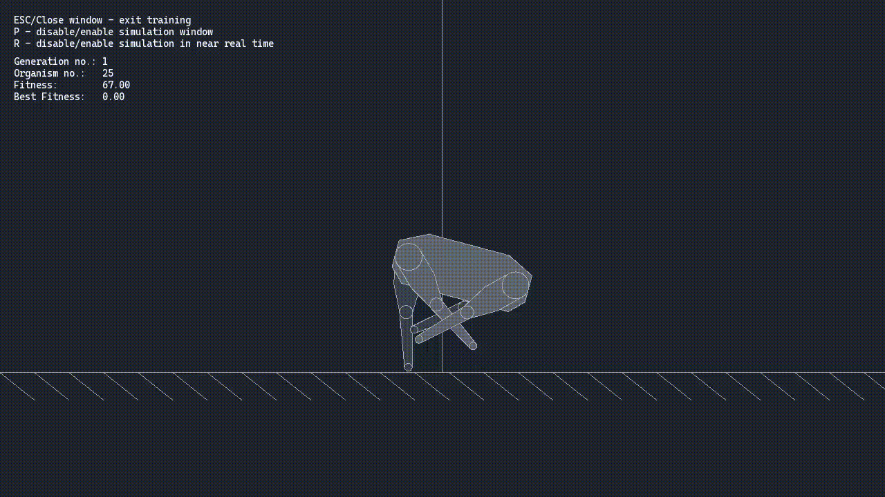
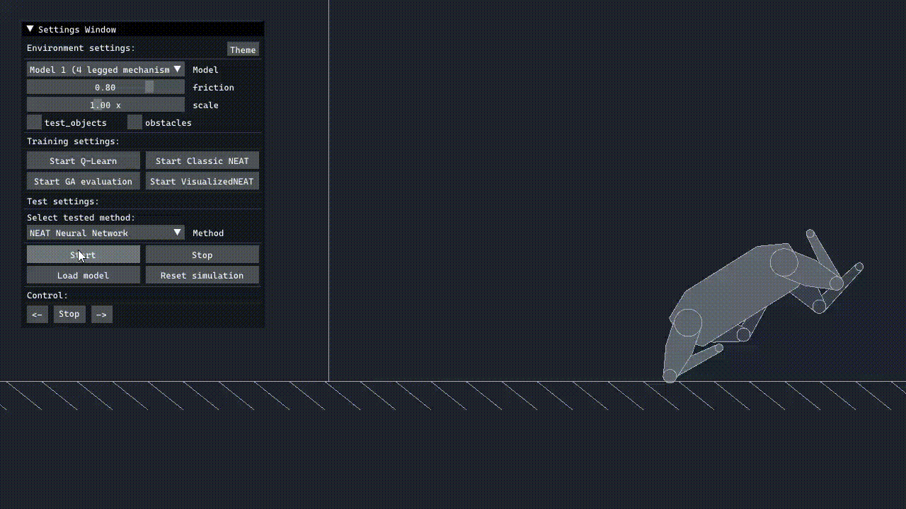
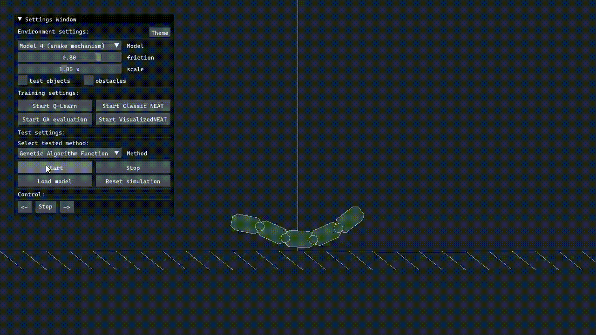

# ML 2D simulation Environment
## Description:  
Program implements simulation environment for reinforcement learning methods used to control motion of walking robots. Available methods are: **Deep Q Learning**, **NEAT (NeuroEvolution of Augmenting Topologies)**, and **Genetic Algorithm**. Code implements 6 models of walking robots in 2D space. Models can be train and tested. Data in training process is displayed in terminal window. Output netowrks or genotypes are stored with other training data in txt files. Program made in VS 2022 - msvc 14.3 and tested on win 10/11. To use this code you need to manually add mlpack library. Project configured in debug and release. For release copy folder models to working directory.
## Used libraries:
- Box2D - https://box2d.org/, https://github.com/erincatto/box2d
- SFML - https://www.sfml-dev.org/download.php, https://github.com/SFML/SFML
- Dear ImGui - https://github.com/ocornut/imgui
- imgui-sfml - https://github.com/eliasdaler/imgui-sfml
- OpenGA - https://github.com/Arash-codedev/openGA
- NEAT C++ - https://nn.cs.utexas.edu/?neat-c
- NEAT Visualizer - https://sourceforge.net/projects/neatvisualizers/
- mlpack - https://www.mlpack.org/, https://github.com/mlpack/mlpack
  
## Examples:  
Program window:  
  
Training window:  
  
Training proces example:  
  
Testing results example:  
  
  
  

## Comments:  
> TODO Cmake
